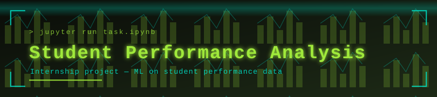

<p align="center">
  
</p>

<p align="center">
  
</p>

<p align="center">
  <a href="https://github.com/muqeetahmaad9/student-performance-internship/stargazers"></a>
  <a href="https://github.com/muqeetahmaad9/student-performance-internship/commits"></a>
  
</p>

---

### 📖 Overview

A four-notebook analysis of student performance data, covering exploration, feature work, modelling and evaluation. Completed as internship coursework.

### ✨ Features

- Task 1 — data exploration and cleaning
- Task 2 — feature engineering
- Task 3 — model training and comparison
- Task 4 — evaluation and findings

### 🧰 Built With

<p align="left">
  
</p>

### 🚀 Getting Started

```bash
jupyter notebook task1.ipynb
```

### 👤 Author

**Muqeet Ahmad** — AI/ML Engineer · IoT & Embedded Systems Builder

<p align="left">
  <a href="https://www.linkedin.com/in/muqeet--ahmad/"></a>
  <a href="https://muqeetahmaad-portfolio.netlify.app/"></a>
  <a href="mailto:muqeetahmad155@gmail.com"></a>
</p>

<p align="center">
  
</p>
